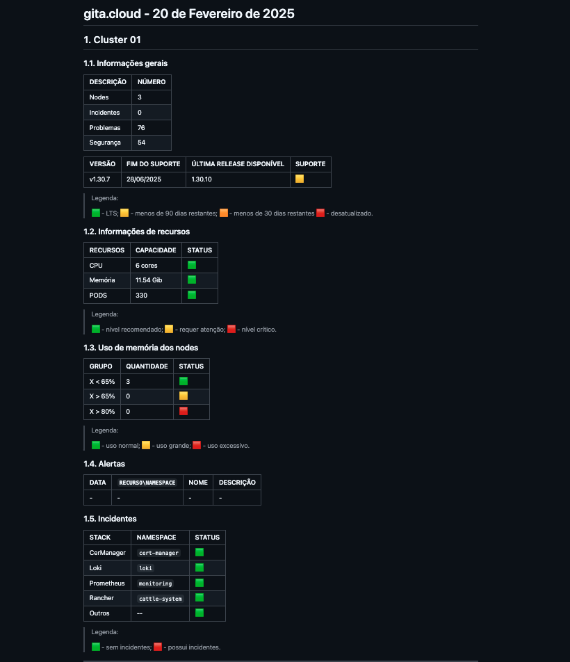
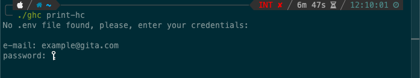
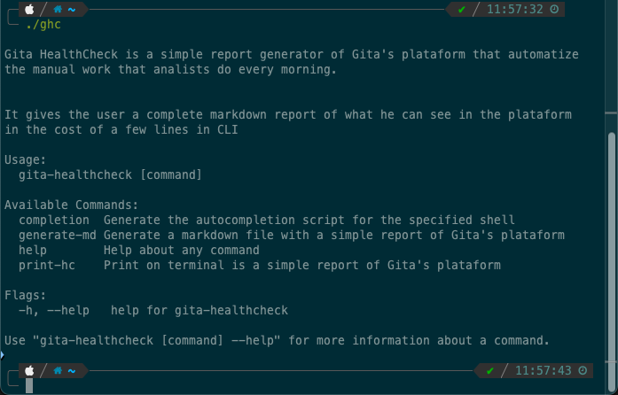
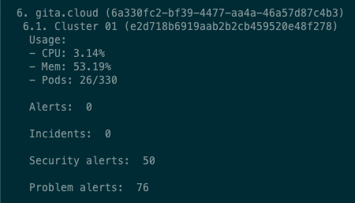
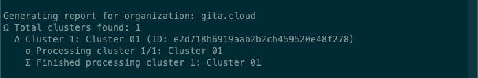

# GHC

GHC é uma interface de linha de comando para geração de relatórios de saúde de clusters registrados na plataforma [GITA](https://gita.cloud).

- [GHC](#ghc)
  - [Visão geral](#visão-geral)
  - [Uso da ferramenta](#uso-da-ferramenta)
    - [Clone e criação do binário](#clone-e-criação-do-binário)
  - [Melhorias futuras](#melhorias-futuras)

## 1. Visão geral

GHC utiliza as credenciais do usuário para acessar a API da plataforma, coletar dados e, então, gerar o relatório mostrado no template abaixo:



As informações coletadas são para geração de relatórios são:

- Uso de recursos
- Versionamento do Kubernetes
- Número de nodes
- Número de problemas
- Número de alertas de segurança
- Dados sobre Incidentes
- Dados sobre Alertas

## 2. Uso da ferramenta

**Pré-requisitos:**

- Go instalado na versão 1.23.5 ou superior
- Uma conta na plataforma Gita
- 

### 2.1. Clone e criação do binário

Para utilizar o binário, faça o clone do repositório:

```bash
git clone https://gitlab.com/jackexperts/healthcheck-jack-experts/gita-healthcheck-generator
```

Então, construa o binário:

```bash
$ cd gita-healthcheck-generator

$ go build -o ./bin/ghc main.go

$ chmod +x ./bin/ghc
```

Então, mova o arquivo para a pasta desejada e execute a ferramenta.

### 2.2. Autenticação

Independente da operação executada, a ferramenta requisita credenciais para autenticação na plataforma. 

A primeira é utilizando variáveis de ambiente ou um arquivo `.env` no mesmo nível do binário. Em toda execução, a ferramenta buscará as variáveis `EMAIL` e `PASSWORD` no ambiente ou, somente senão encontrar, requisitará ao usuário conforme mostrado abaixo:



### 2.2 Geração de relatórios

GHC tem duas operações definidas para o usuário:

- `print-hc`
- `generate-md`

Conforme mostrado abaixo:



A primeira, `print-hc`, imprime no terminal um pequeno resumo das informações coletadas: 



A segunda, `generate-md`, coletará as informações e gerará os relatórios  confore o template mostrado a cima: 



## 3. Melhorias futuras

- Funcionalidade para gerar relatórios de clusters específicos
- Melhorar as saídas no terminal
- Adicionar no Gita
- Autenticação a partir de token